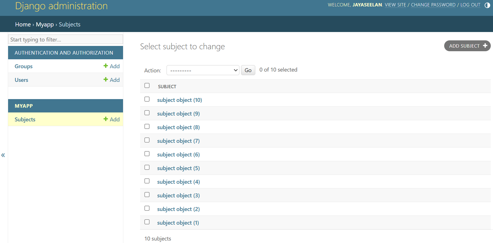
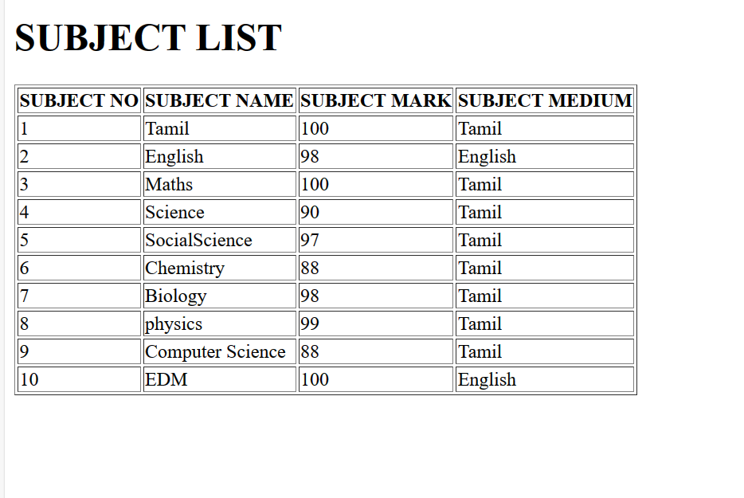
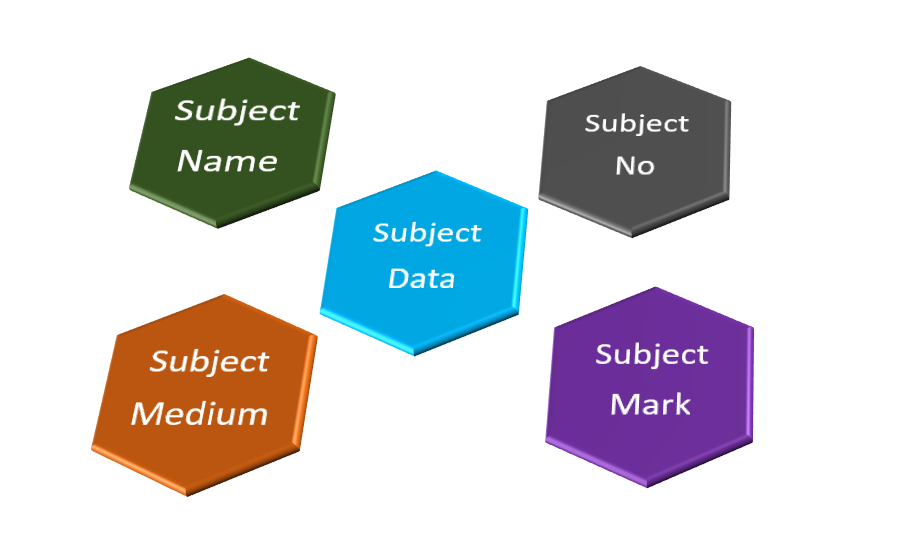

# Ex02 Django ORM Web Application
## Date: 

## AIM
To develop a Django application to store and retrieve data from a subject database using Object Relational Mapping(ORM).

## Entity Relationship Diagram

Include your ER diagram here

## DESIGN STEPS

### STEP 1:
Clone the problem from GitHub

### STEP 2:
Create a new app in Django project

### STEP 3:
Enter the code for admin.py and models.py

### STEP 4:
Execute Django admin and create details for 10 subject

## PROGRAM

'''
admin.py

from django.contrib import admin
from .models import subject
admin.site.register(subject)

model.py

from django.db import models

# Create your models here.
class subject(models.Model):
    subjectid = models.IntegerField()
    subjectname= models.CharField(max_length=20)
    subjectmark = models.CharField(max_length=20)
    subjectmedium = models.CharField(max_length=20)

'''

## OUTPUT

## RESULT
Thus the program for creating a database using ORM hass been executed successfully
